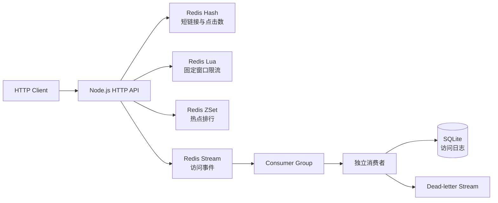

# Redis Shortlink Lab

一个使用 Node.js、TypeScript 和 Redis 实现的短网址学习项目。项目从 String 与 TTL 开始，逐步加入 Hash、ZSet、Lua 限流和 Redis Stream，用可运行的业务场景理解 Redis 的数据结构、原子性与消息消费语义。

这不是面向生产环境的完整短网址平台。仓库保留了若干有意暴露的并发与一致性边界，用于学习它们为什么出现，以及 Lua、Consumer Group、幂等写入等机制分别解决什么问题。

## 功能

- 创建带 TTL 的 6 位短链接
- 通过 Redis Hash 保存目标地址、创建时间和点击数
- 使用 `HINCRBY` 原子增加点击数
- 使用 ZSet 维护实时热点排行榜
- 支持本地、Redis 多命令和 Lua 三种固定窗口限流策略
- 使用 Stream 发布短链接访问事件
- 使用 Consumer Group、PEL、`XACK` 和 `XAUTOCLAIM` 消费及恢复消息
- 超过最大投递次数后写入死信 Stream
- 使用 SQLite 和 Stream message ID 幂等保存访问日志

## 架构



成功访问短链接时，HTTP 服务依次执行：

```text
读取短链接 -> 限流 -> 点击计数 -> 排行榜 -> XADD -> 302 重定向
```

消费者执行：

```text
XREADGROUP/XAUTOCLAIM -> SQLite 幂等写入 -> XACK
                                |
                                +-> 多次失败后写入死信 Stream
```

## 技术要求

- Node.js 22.5 或更高版本
- npm
- Redis 7.x

项目使用 Node.js 内置的 `node:sqlite`。在部分 Node.js 22 版本中，它会输出 `ExperimentalWarning`，不影响本项目运行。

## 快速开始

### 1. 安装依赖

```bash
npm install
```

### 2. 启动 Redis

如果本地没有 Redis，可以使用 Docker：

```bash
docker run --name redis-shortlink-lab-redis \
  -p 6379:6379 \
  -d redis:7
```

确认 Redis 可用：

```bash
docker exec -it redis-shortlink-lab-redis redis-cli ping
```

应返回：

```text
PONG
```

如果复用启用了密码认证的 Redis，使用 `redis-cli --askpass` 验证，不要将真实密码写入命令历史或提交到仓库。

### 3. 配置环境变量

```bash
cp .env.example .env
```

编辑 `.env`：

```env
PORT=3003
REDIS_URL=redis://:your-redis-password@localhost:6379
RATE_LIMIT_STRATEGY=lua
ACCESS_EVENTS_CONSUMER=consumer-1
ACCESS_EVENTS_DB_PATH=data/access-events.db
```

没有密码时，Redis URL 可以写成：

```env
REDIS_URL=redis://localhost:6379
```

`.env` 已被 Git 忽略。

### 4. 启动 HTTP 服务

```bash
npm run dev
```

服务默认监听：

```text
http://localhost:3003
```

### 5. 启动 Stream 消费者

另开一个终端：

```bash
npm run consumer
```

消费者会创建 Consumer Group、读取新事件、恢复超时 Pending，并将有效事件写入 SQLite。

### 6. 构建运行

```bash
npm run build
npm start
```

另一个终端启动编译后的消费者：

```bash
npm run start:consumer
```

## HTTP API

### 健康检查

```bash
curl -i http://localhost:3003/health
```

成功响应：

```json
{"status":"ok","redis":"PONG"}
```

Redis 不可用时返回 `503 Service Unavailable`。

### 创建短链接

```bash
curl -i \
  -X POST \
  -H 'Content-Type: application/json' \
  -d '{"url":"https://example.com/article"}' \
  http://localhost:3003/shorten
```

响应示例：

```json
{
  "code": "a8Zk2Q",
  "shortUrl": "http://localhost:3003/a8Zk2Q",
  "targetUrl": "https://example.com/article",
  "expiresIn": 86400
}
```

只接受 `http:` 和 `https:` URL。请求体最大为 10 KiB。

### 访问短链接

```bash
curl -i http://localhost:3003/a8Zk2Q
```

成功时返回 `302` 和目标地址：

```text
Location: https://example.com/article
```

成功跳转会增加点击数、更新排行榜并写入访问事件。超过限流阈值时返回 `429 Too Many Requests`。

### 查询短链接元数据

```bash
curl -i http://localhost:3003/links/a8Zk2Q
```

响应示例：

```json
{
  "code": "a8Zk2Q",
  "target": "https://example.com/article",
  "createdAt": "2026-08-31T08:00:00.000Z",
  "clickCount": 3
}
```

查询元数据不会增加点击数。

### 查询排行榜

```bash
curl -i http://localhost:3003/ranking
```

响应示例：

```json
{
  "items": [
    {"code":"a8Zk2Q","score":12},
    {"code":"Xy91kL","score":8}
  ]
}
```

最多返回 10 条记录。

## Redis 数据模型

| Key | 类型 | 用途 |
| --- | --- | --- |
| `shortlink:url:<code>` | Hash | `target`、`created_at`、`click_count`，TTL 24 小时 |
| `shortlink:ranking` | ZSet | member 为短码，score 为访问次数 |
| `shortlink:rate:<ip>` | String | 固定窗口请求计数，TTL 1 秒 |
| `shortlink:access-events` | Stream | 成功访问事件，近似保留 10000 条 |
| `shortlink:access-events:dead-letter` | Stream | 达到最大投递次数的失败事件 |
| `shortlink:rate:sliding:<ip>` | ZSet | 滑动窗口内已通过请求 |

常用观察命令：

```redis
HGETALL shortlink:url:<code>
TTL shortlink:url:<code>
ZREVRANGE shortlink:ranking 0 9 WITHSCORES
XRANGE shortlink:access-events - +
XINFO GROUPS shortlink:access-events
XPENDING shortlink:access-events access-log-writers - + 10
XRANGE shortlink:access-events:dead-letter - +
```

不要在共享 Redis 上执行 `FLUSHALL`。实验结束时只删除明确属于本项目的 key。

## 限流策略

通过 `RATE_LIMIT_STRATEGY` 选择：

| 配置 | 实现 | 主要特点 |
| --- | --- | --- |
| `local` | Node.js `Map` | 单进程有效；重启丢失；不支持多实例共享 |
| `redis` | `INCR` + `EXPIRE` | 多实例共享，但两个命令之间存在崩溃窗口 |
| `lua` | Redis Lua | 原子完成计数、首次设置 TTL 和阈值判断；默认策略 |
| `sliding` | Lua + ZSet | 精确滑动窗口，每个已通过请求保存一个 member |

当前算法是固定窗口：同一 IP 每秒最多通过 5 次请求。Lua 解决了多命令原子性，但没有解决窗口边界突发问题。

## Stream 消费语义

- Consumer Group 名称为 `access-log-writers`。
- 每个消费者应使用不同的 `ACCESS_EVENTS_CONSUMER`。
- `XREADGROUP` 使用 `>` 读取尚未分配的新消息。
- 已投递但未确认的消息记录在 Pending Entries List（PEL）。
- `XACK` 只清除该组的 Pending 状态，不删除 Stream 本体消息。
- `XAUTOCLAIM` 接管 idle 超过 10 秒的 Pending。
- 消息最多投递 3 次，之后进入死信 Stream。
- 消费者周期性恢复 Pending，然后阻塞读取新消息。

SQLite 表使用 Stream message ID 作为主键：

```sql
CREATE TABLE access_events (
  message_id TEXT PRIMARY KEY,
  code TEXT NOT NULL,
  ip TEXT NOT NULL,
  target TEXT NOT NULL,
  accessed_at TEXT NOT NULL,
  consumed_at TEXT NOT NULL
);
```

数据库写入发生在 `XACK` 之前。写入成功但 ACK 失败时，重新投递会命中主键冲突并被视为已处理，因此不会产生重复行。这是幂等消费效果，不是 Redis 与 SQLite 之间的 exactly-once 分布式事务。

查询本地访问日志：

```bash
node -e "const {DatabaseSync}=require('node:sqlite');const db=new DatabaseSync('data/access-events.db');console.table(db.prepare('SELECT * FROM access_events ORDER BY consumed_at DESC').all());db.close()"
```

## 多消费者实验

可以使用不同名称启动两个消费者：

```bash
ACCESS_EVENTS_CONSUMER=consumer-1 npm run consumer
ACCESS_EVENTS_CONSUMER=consumer-2 npm run consumer
```

它们属于同一个 Consumer Group，新消息会被分配给其中一个消费者，而不是广播给每个消费者。

## 项目结构

```text
src/
  server.ts                  HTTP 路由与应用生命周期
  redis.ts                   Redis 客户端生命周期
  config.ts                  项目配置与常量
  short-link/                短链接 Hash 与点击计数
  ranking/                   ZSet 排行榜
  rate-limit/                三种固定窗口限流实现
  access-events/
    producer.ts              Stream 生产者
    consumer.ts              Consumer Group、ACK、恢复和死信
    store.ts                 SQLite 幂等存储
    types.ts                 事件类型
notes/                       各阶段实验记录
plan.md                      学习路线
```

## 当前边界

- Hash 创建使用 `EXISTS + MULTI`，检查与写入之间仍有短码碰撞竞态。
- 点击增加使用 `EXISTS + HINCRBY`，key 在两条命令之间过期时可能被重建且没有 TTL。
- Hash 点击数与 ZSet 排行榜通过两条命令更新，可能短暂或永久不一致。
- Hash 过期不会自动删除排行榜中的 ZSet member。
- 限流采用固定窗口，存在窗口边界突发。
- 访问路径同步等待 `XADD`；事件写入失败会阻止重定向，但此前完成的计数不会回滚。
- 死信写入成功但源消息 ACK 失败时，可能产生重复死信。
- SQLite 使用同步 API，适合学习和低吞吐消费者，不代表高并发生产存储方案。
- 当前尚未提供自动化测试。

这些边界在 [plan.md](./plan.md) 和 [notes](./notes) 中有对应实验与讨论。

## 学习路线

| Phase | Redis 能力 | 应用实践 |
| --- | --- | --- |
| 1 | String、TTL、`SET NX EX` | 短网址映射与过期 |
| 2 | Hash、`HINCRBY` | 结构化元数据与点击计数 |
| 3 | ZSet、`ZINCRBY` | 实时热点排行榜 |
| 4 | `INCR`、`EXPIRE`、Lua | 分布式固定窗口限流 |
| 5 | Stream、Consumer Group、PEL | 异步日志、恢复、死信与幂等落库 |

后续可继续实现令牌桶限流、自动化测试，以及 RDB/AOF、淘汰策略、主从复制、Sentinel 和 Cluster 等生产化实验。

## License

[MIT](./LICENSE)
